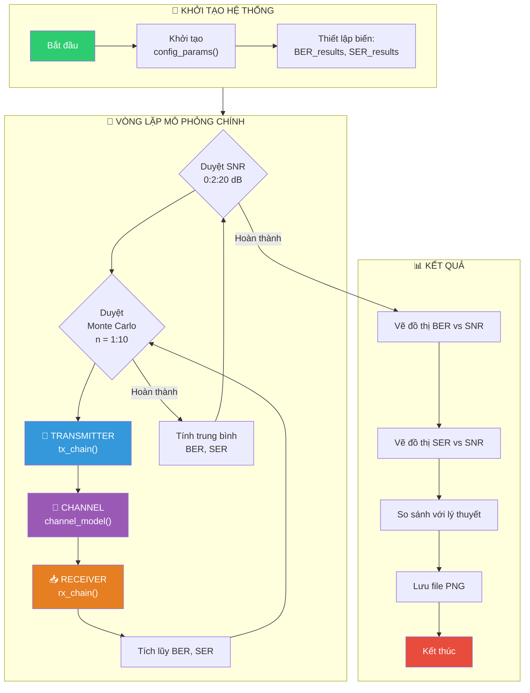
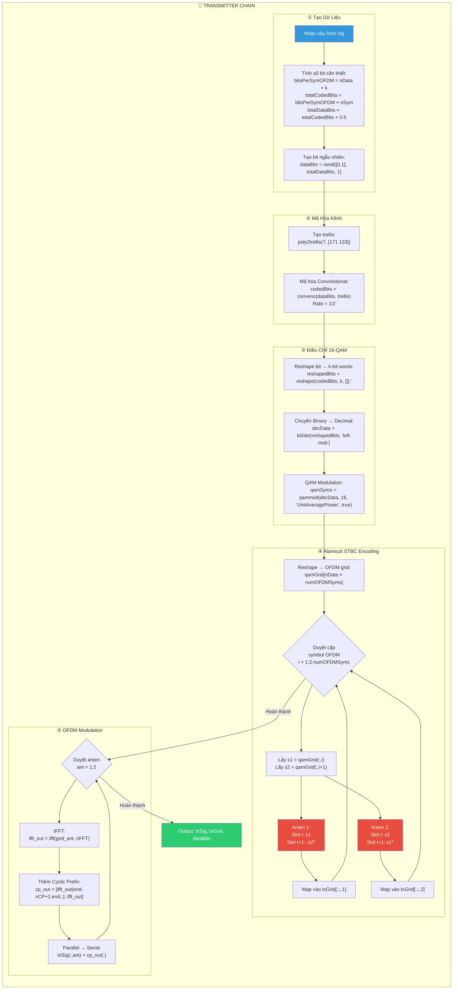
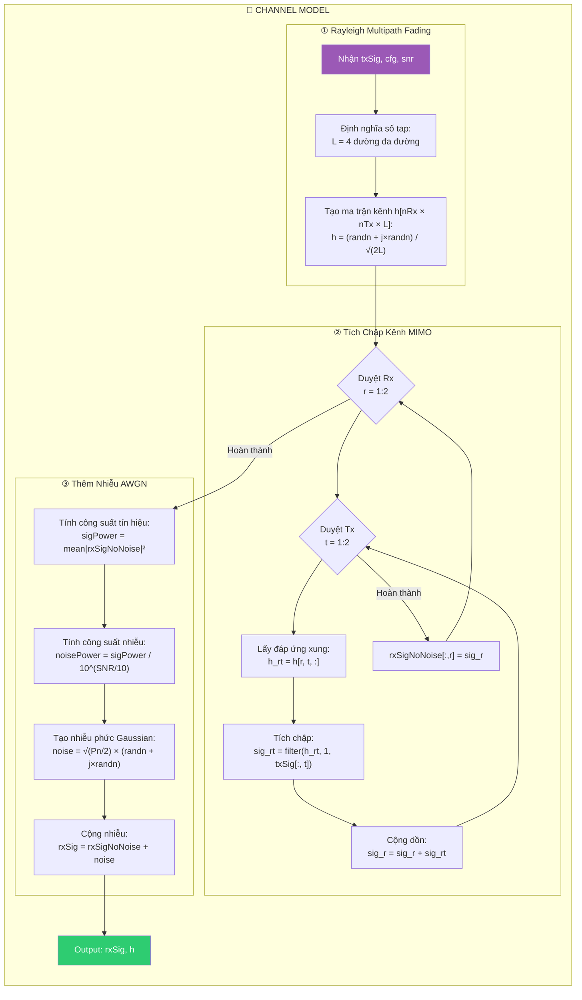
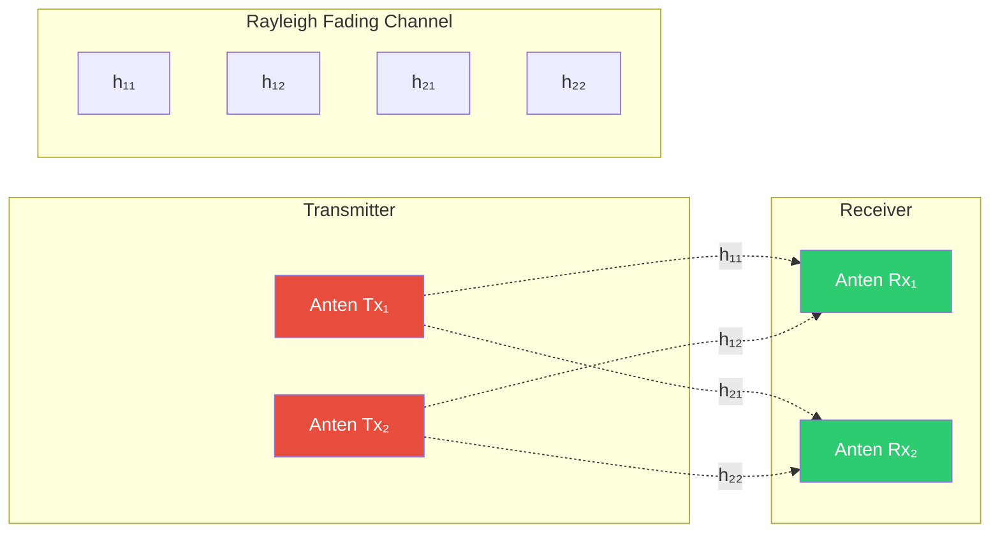
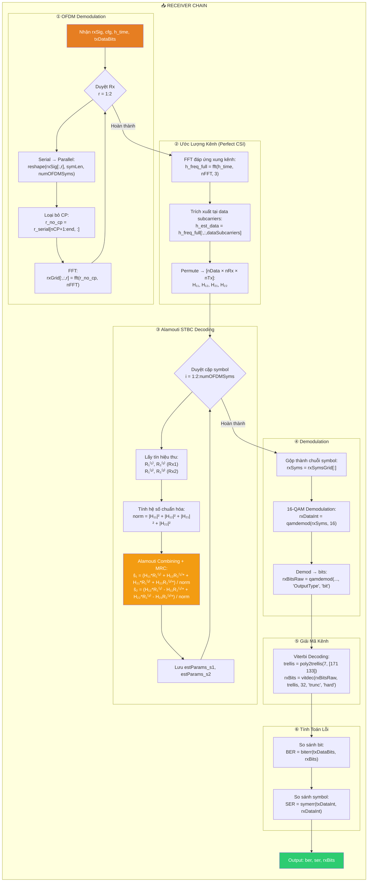
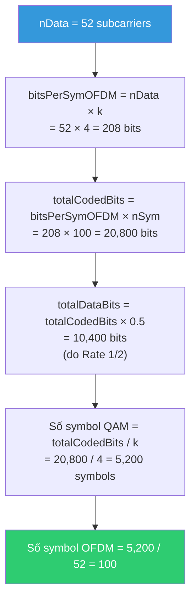
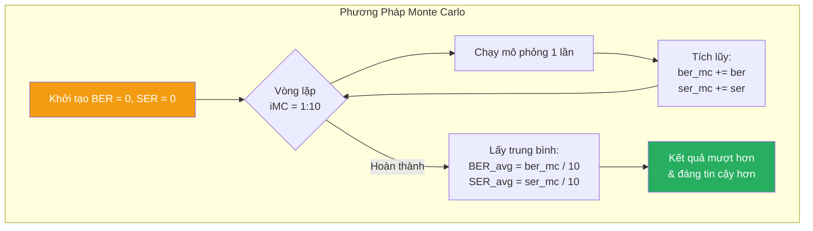

# Lưu Đồ Thuật Toán Mô Phỏng Hệ Thống 2x2 MIMO-OFDM

Tài liệu này mô tả chi tiết lưu đồ thuật toán của hệ thống mô phỏng 2x2 MIMO-OFDM với Alamouti STBC.

---

## 1. Lưu Đồ Tổng Quan Hệ Thống



---

## 2. Lưu Đồ Chi Tiết Khối Transmitter (tx_chain.m)



### Bảng Ma Trận Alamouti STBC (Space-Time)

| Thời gian | Anten 1 | Anten 2 |
|-----------|---------|---------|
| Slot t    | s₁      | s₂      |
| Slot t+1  | -s₂*    | s₁*     |

---

## 3. Lưu Đồ Chi Tiết Khối Channel (channel_model.m)



### Mô Hình Kênh MIMO 2×2



---

## 4. Lưu Đồ Chi Tiết Khối Receiver (rx_chain.m)



### Công Thức Alamouti Combining cho 2×2 MIMO

Với hệ thống 2×2 (2 Tx, 2 Rx), công thức kết hợp Maximal Ratio Combining (MRC):

**Tại Rx₁:**
```
r₁⁽¹⁾ = h₁₁·s₁ + h₁₂·s₂ + n₁⁽¹⁾
r₂⁽¹⁾ = -h₁₁·s₂* + h₁₂·s₁* + n₂⁽¹⁾
```

**Tại Rx₂:**
```
r₁⁽²⁾ = h₂₁·s₁ + h₂₂·s₂ + n₁⁽²⁾
r₂⁽²⁾ = -h₂₁·s₂* + h₂₂·s₁* + n₂⁽²⁾
```

**Kết hợp MRC:**
```
ŝ₁ = (h₁₁*·r₁⁽¹⁾ + h₁₂·r₂⁽¹⁾* + h₂₁*·r₁⁽²⁾ + h₂₂·r₂⁽²⁾*) / Σ|hᵢⱼ|²
ŝ₂ = (h₁₂*·r₁⁽¹⁾ - h₁₁·r₂⁽¹⁾* + h₂₂*·r₁⁽²⁾ - h₂₁·r₂⁽²⁾*) / Σ|hᵢⱼ|²
```

---

## 5. Lưu Đồ Luồng Dữ Liệu End-to-End

```mermaid
flowchart LR
    subgraph SOURCE["Nguồn"]
        A["Data Bits<br/>randi([0,1])"]
    end
    
    subgraph TX_PROC["Xử Lý Phát"]
        B["Convolutional<br/>Encoder<br/>(Rate 1/2)"]
        C["16-QAM<br/>Modulator"]
        D["Alamouti<br/>STBC<br/>Encoder"]
        E["OFDM<br/>Modulator<br/>(IFFT + CP)"]
    end
    
    subgraph CHANNEL["Kênh"]
        F["Rayleigh<br/>Multipath<br/>Fading"]
        G["AWGN<br/>Noise"]
    end
    
    subgraph RX_PROC["Xử Lý Thu"]
        H["OFDM<br/>Demodulator<br/>(Remove CP + FFT)"]
        I["Channel<br/>Estimation<br/>(Perfect CSI)"]
        J["Alamouti<br/>Combiner<br/>+ MRC"]
        K["16-QAM<br/>Demodulator"]
        L["Viterbi<br/>Decoder"]
    end
    
    subgraph SINK["Đích"]
        M["Recovered<br/>Data Bits"]
    end
    
    A --> B --> C --> D --> E
    E -->|"Tx₁"| F
    E -->|"Tx₂"| F
    F --> G
    G -->|"Rx₁"| H
    G -->|"Rx₂"| H
    H --> I --> J --> K --> L --> M
    
    style A fill:#27ae60,color:#fff
    style M fill:#27ae60,color:#fff
    style F fill:#9b59b6,color:#fff
    style G fill:#e74c3c,color:#fff
```



---

## 6. Tham Số Hệ Thống (config_params.m)

| Tham số | Giá trị | Mô tả |
|---------|---------|-------|
| **nTx** | 2 | Số anten phát |
| **nRx** | 2 | Số anten thu |
| **M** | 16 | Bậc điều chế (16-QAM) |
| **k** | 4 | Số bit/symbol |
| **nFFT** | 64 | Kích thước FFT |
| **nCP** | 16 | Độ dài Cyclic Prefix |
| **nData** | 52 | Số subcarrier dữ liệu |
| **nSym** | 100 | Số symbol OFDM/vòng lặp |
| **constraintLength** | 7 | Độ dài ràng buộc mã chập |
| **codeGenerator** | [171 133] | Đa thức sinh (Octal) |
| **snrRange** | 0:2:20 | Dải SNR mô phỏng (dB) |
| **nMonteCarlo** | 10 | Số lần lặp Monte Carlo |

---

## 7. Lưu Đồ Tính Toán Số Lượng Dữ Liệu



---

## 8. Tóm Tắt Quy Trình Monte Carlo



---

> **Lưu ý:** Các lưu đồ trên mô tả chi tiết thuật toán mô phỏng hệ thống 2×2 MIMO-OFDM với Alamouti STBC. Để hiểu sâu hơn về lý thuyết, vui lòng tham khảo [Theory.md](./Theory.md).
